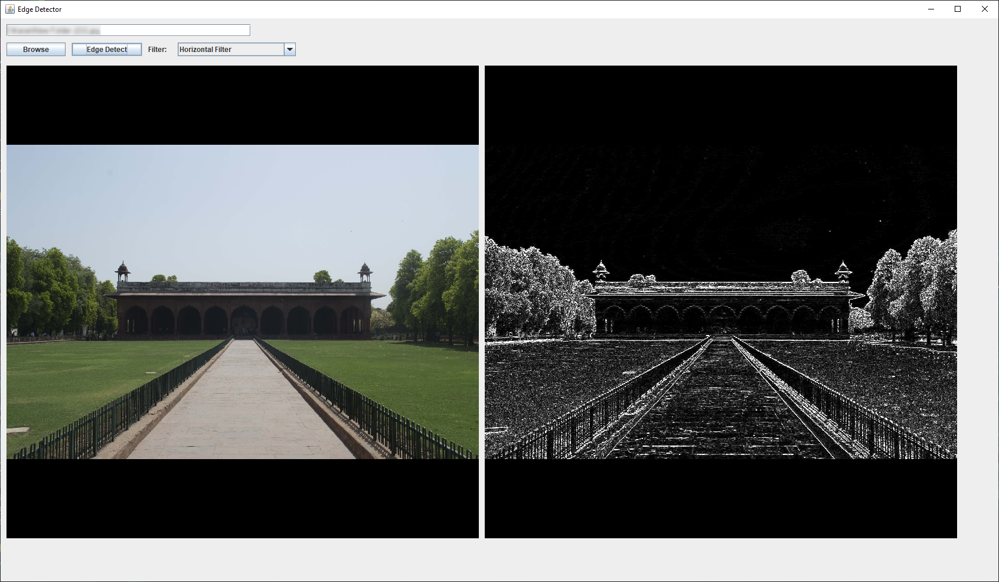

# Edge Detection Filter GUI
Edge Detection Filter GUI using Java

Special Thanks to:
Hands-On Java Deep Learning for Computer Vision by Klevis Ramo [source]()
[Robert Streetman](https://github.com/rstreet85) for Canny Operator Implementation: https://github.com/rstreet85/JCanny
